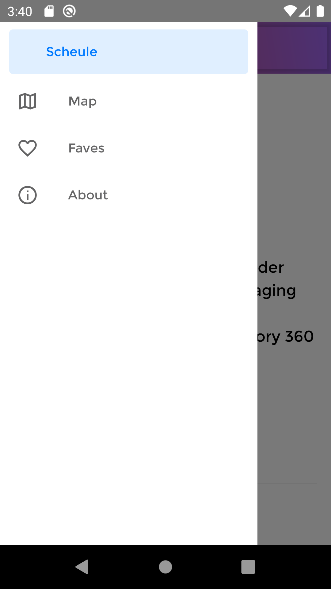

# R10

R10 is a React Native mobile application designed to provide developers with access to event schedules, details about upcoming conferences. Highlighted features include map feature and saving sessions, allowing easy access to the user's favourited sessions.

## Getting Started

Please follow in the instructions below to properly install and run the application.

## Prerequisites

R10 requires XCode and Android Studio to be installed, as the app will run on iOS and Android simulators.

## Installation

Run the following commands to start the application:

### iOS

react-native run-ios

### android

react-native run-android

## User Instructions

Navigate through the app with the bottom tabs for iOS and side drawer for android.

## Built With

<ul>
<li>React-Native</li>
<li>GraphQL</li>
<li>React-Native-Maps</li>
<li>Apollo Query</li>
<li>React-Native-Vector-Icons</li>
<li>React-Native-Linear-Gradient</li>
</ul>

## Screenshot

### iOS

### Android

